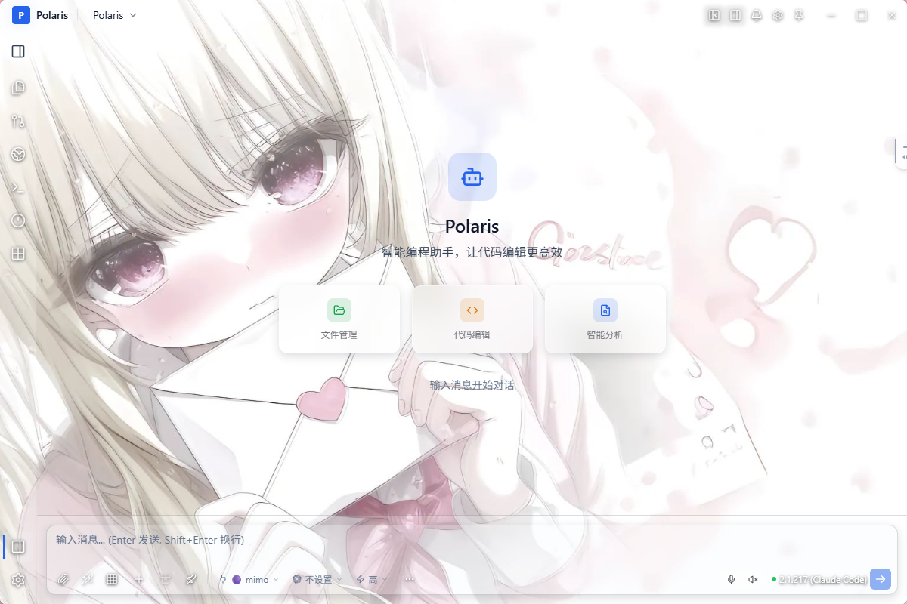

# Polaris Acrylic Edition
一款基于 Polaris 二次定制、采用现代毛玻璃拟态UI的AI桌面客户端

## 功能亮点
- 借鉴 Apple Vision Pro 风格的亚克力磨砂玻璃界面
- 动态壁纸背景系统，支持背景自动切换
- 全局统一通透毛玻璃面板视觉体系
- 针对 Git 面板、终端面板、内置浏览器面板专门优化亚克力样式
- 重构弹窗模态系统，动画与交互更加流畅自然
- 重新设计响应式下拉菜单布局，解决原始界面布局瑕疵
- 完整中文代理文本本地化适配
- 大规模UI优化：间距、阴影、视觉层级统一调整
- 优化窗口交互、悬浮反馈与过渡动画

## 项目介绍
本项目是开源项目 Polaris 的界面二次美化改版分支。
程序底层核心业务逻辑与原版保持一致。
修改内容集中在视觉表现、页面布局、样式美化与交互体验优化。

> ⚠️ 本分支为非官方定制版本，不属于 Polaris 官方项目。

## 源码来源
基础原版项目：
https://github.com/misxzaiz/Polaris

## 开源声明
- 本仓库代码仅用于学习交流。
- 项目遵循原 Polaris 仓库开源协议。
- 所有底层核心代码版权归原项目作者所有。
- 本分支全部UI美化、视觉改动由分支维护者独立完成。

## 上游同步说明
你可以手动拉取上游原版仓库的最新更新。
由于大量界面样式文件改动，合并上游更新时需要人工处理代码冲突。

## 效果预览


## 编译运行
```bash
# 克隆仓库
git clone https://github.com/jianyiyii/Polaris-AcrylicEdition-UI.git
cd Polaris-AcrylicEdition-UI

# 安装依赖
npm install

# 启动开发调试
npm run dev

# 打包正式安装程序
npm run build
